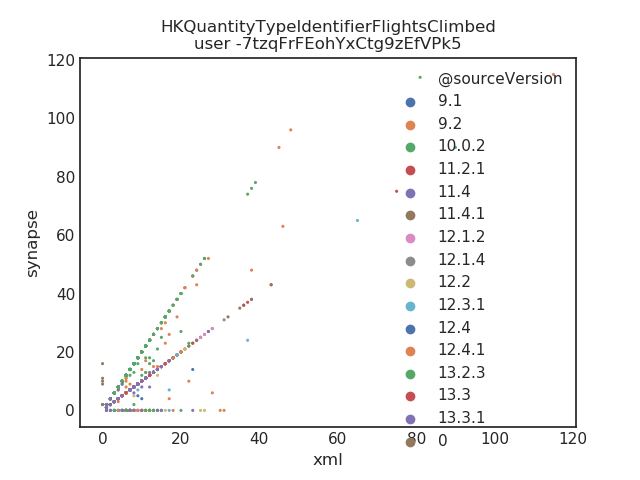
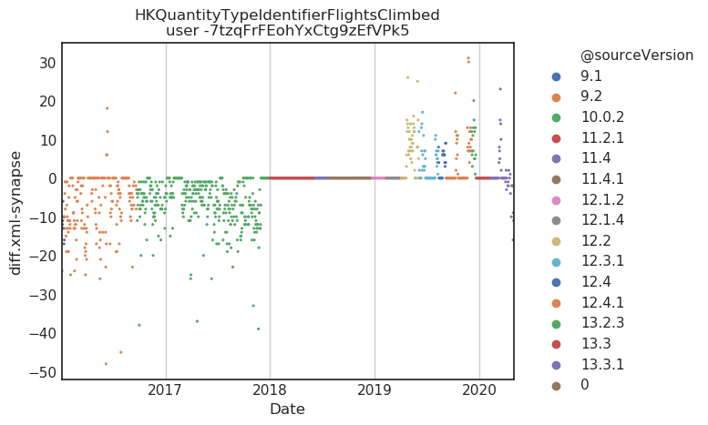

## Results


Running analyses: clone github repo and use the script `compare_xml_to_synapse.py` as shown below:

```
/home/groups/khavari/users/dskim89/git/my-heart-counts/compare_xml_to_synapse.py $healthcode_id /oak/stanford/groups/euan/users/dskim89/mhc/xml.zip
```

---

### Analyses on BB

#### Preprocessing

- Filtered for just iPhone data
- Considered QC checks per mhc parsers
- Adjusted datetime for daylight savings
- the XML is labelling some data as iphone8 when it's probably iphone6 (see plot below)
- ignore transition days (days when iOS was updated on phone)

#### Step counts

Starting with a case study of `HKQuantityTypeIdentifierStepCount`, initial comparison of values to values in xml:


Same plot, but color adjusted for device:


Same plot, but color adjusted for iOS version:


Now, shown in a chronological way. Note that this is a difference plot, where I take the values from the xml and synapse (aggregated by day) and then take the difference (xml - synapse). Colors here represent whether synapse had a non-zero data value for a day where the xml had a non-zero value (ie, `Present` vs `Missing.S`):


Same plot, but recolored for device:


Same plot, but colored by iOS version:


Takeaways:

- Differences between synapse and xml are likely due to
  - some iphone confusion as stored in xml pre-2018
  - some missingness in synapse
  - new data beyond xml pull.

#### Distance walked/ran

Initial comparison of values to values in xml:


Same plot, but color adjusted for device:


Same plot, but color adjusted for iOS version:


Now, shown in a chronological way. Note that this is a difference plot, where I take the values from the xml and synapse (aggregated by day) and then take the difference (xml - synapse). Colors here represent whether synapse had a non-zero data value for a day where the xml had a non-zero value (ie, `Present` vs `Missing.S`):


Same plot, but recolored for device:


Same plot, but colored by iOS version:


Takeaways:

- Little bit harder to parse because of units discrepancy
- Likely much of the missingness is in the same pre-2018 category


#### Flights climbed

Initial comparison of values to values in xml:


Same plot, but color adjusted for device:


Same plot, but color adjusted for iOS version:



Now, shown in a chronological way. Note that this is a difference plot, where I take the values from the xml and synapse (aggregated by day) and then take the difference (xml - synapse). Colors here represent whether synapse had a non-zero data value for a day where the xml had a non-zero value (ie, `Present` vs `Missing.S`):


Same plot, but recolored for device:


Same plot, but colored by iOS version:



Takeaways:

- Some interesting algorithm change (or hardware effect) on calculating flights climbed
- some odd missingness in 2019 that seems to match up most with iOS version

#### Summary

- Much of the data is there and concordant between xml and synapse after 2018
- There is a complication of iphone mismatched information in the xml file, this may or may not be recoverable?
- There does exist some synapse missingness
- The missingness looks potentially metric-dependent, need more xmls to check

---

### Analyses on AL


Too much data missingness in xml to compare:

